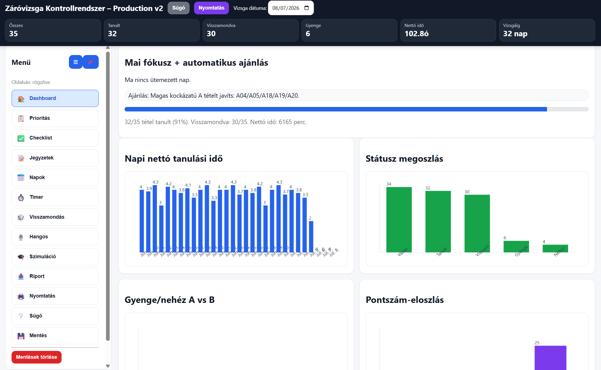

# Záróvizsga Kontrollrendszer

<p align="center">
  <strong>Offline tanulásmenedzsment és felkészülési kontrollrendszer záróvizsgára</strong><br>
  Pure HTML + CSS + JavaScript • LocalStorage • JSON backup • No backend
</p>

<p align="center">
  
</p>

---

## Áttekintés

A **Záróvizsga Kontrollrendszer** egy offline, böngészőben futó tanulásmenedzsment alkalmazás, amely segít strukturáltan követni a záróvizsga-felkészülést.

A rendszer célja, hogy ne csak azt kövesd, hogy „olvastad-e” a tételeket, hanem azt is, hogy:

- melyik tételből van már vázlatod,
- melyiket tanultad meg,
- melyiket tudtad visszamondani,
- melyik gyenge vagy nehéz,
- mennyi nettó időt tanultál naponta,
- mennyi időt fordítottál egy konkrét tételre,
- milyen pontszámot adnál magadnak vizsgaszint szerint.

---

## Fő funkciók

- **Dashboard** – állapotcsempék, napi fókusz, grafikonok, automatikus ajánlás.
- **Prioritási kártyák** – tételenkénti státusz, pontszám, kockázat, nehézség, időráfordítás.
- **Tanulási timer** – aktív tétel kiválasztása után a fókuszperceket a naphoz és a tételhez is hozzárendeli.
- **Napok követése** – napi nettó tanulási idő manuálisan is szerkeszthető.
- **Tételenkénti jegyzetek** – feleletvázlat, kulcsfogalmak, kérdések, hibajegyzetek.
- **Random visszamondás** – előnyben részesíti a gyenge, nehéz vagy nem visszamondott tételeket.
- **Hangos visszamondás sablon** – önértékelés struktúra, pontosság, példák és folyékonyság alapján.
- **Vizsgaszimuláció** – A és B tétel húzása, felkészülési és felelési idővel.
- **Napi riport** – bemásolható státuszjelentés a következő napi tervhez.
- **JSON export/import** – fájlos mentés és visszatöltés.
- **Nyomtatható összefoglaló** – prioritásos javítandók és állapotlista.

---

## Módszertan

### Opció A – kiegyensúlyozott terv

Ez az alapértelmezett stratégia.

- Minden tétel első feldolgozása.
- Ismétlés és javítás.
- Aktív, jegyzet nélküli visszamondás.
- Vizsgaszimuláció a végső szakaszban.

### Opció B – gyors lefedés

Akkor hasznos, ha gyorsan szeretnéd átlátni a teljes anyagot.

- Rövid idő alatt sok tétel első körös feldolgozása.
- Utána intenzív ismétlés.
- Magasabb tempó, nagyobb terhelés.

### Opció C – fallback / minimum túlélő terv

Akkor aktiválandó, ha sok a kiesés vagy közel a vizsga.

- Minden tételből minimum 5–7 perces feleletvázlat.
- Új részletek helyett gyenge pontok javítása.
- Cél: biztos, vizsgán elmondható minimum.

---

## Használat

1. Nyisd meg a `zarovizsga_kontrollrendszer_production_final.html` fájlt böngészőben.
2. A **Timer** fülön válaszd ki az aktív tételt.
3. Indíts fókuszblokkot.
4. A **Prioritás** fülön jelöld a tétel státuszát.
5. Pontozd a tételt 0–3 között.
6. Nap végén generálj riportot.
7. Exportálj JSON mentést.

---

## Pontozás

| Pont | Jelentés |
|---:|---|
| 0 | Nem tudom elkezdeni. |
| 1 | Felismerem, de nem tudom összefüggően elmondani. |
| 2 | Részben megy, de vannak hiányok. |
| 3 | Vizsgaszinten megy, példával és struktúrával. |

---

## Mentés és visszatöltés

Az alkalmazás automatikusan ment a böngésző `localStorage` tárhelyére, de a biztonságos használathoz ajánlott rendszeresen JSON fájlt exportálni.

**Ajánlott napi rutin:**

```text
Mentés → Export JSON fájl
```

Visszatöltés:

```text
Mentés → Import JSON fájlból
```

---

## Technológia

- HTML
- CSS
- JavaScript
- LocalStorage
- JSON export/import
- Backend nélkül működik
- Internetkapcsolat nélkül is használható

---

## Projektstruktúra

```text
.
├── zarovizsga_kontrollrendszer_production_final.html
├── README.md
└── screenshot.png
```

---

## Licenc

MIT License

---

## Szerző

**Készítette:** Drobina, Zsolt (GL0LFK)  
**License:** MIT license
