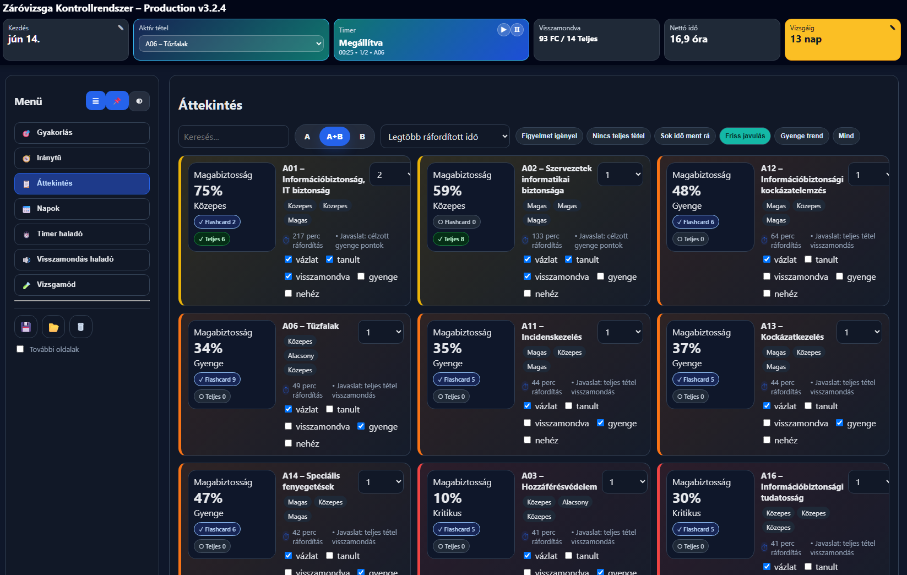
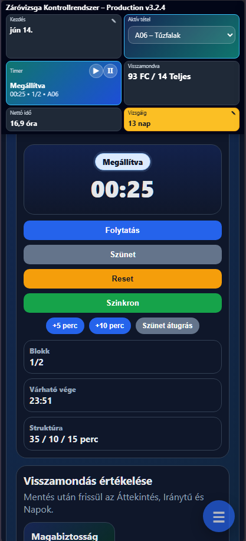

[](https://github.com/GL0LFK/graduation_exam)
# Záróvizsga Kontrollrendszer

> **Legújabb release:** v3.2.4  
> **Letöltés:** [zarovizsga_v3.2.4_live.html](https://github.com/user-attachments/files/29361465/zarovizsga_v3.2.4_live.html)
> 

<p align="center">
  <strong>Offline, mobilbarát tanulásmenedzsment és felkészülési kontrollrendszer záróvizsgára</strong><br>
  Egyfájlos HTML alkalmazás • LocalStorage • JSON export/import • Responsive UI • Világos/sötét téma
</p>

---

## Képernyőképek

### Asztali nézet

<table>
  <tr>
    <td align="center">
      <strong>Sötét téma</strong><br>
      
    </td>
    <td align="center">
      <strong>Áttekintés</strong><br>
      
    </td>
  </tr>
  <tr>
    <td align="center">
      <strong>Gyakorlás</strong><br>
      
    </td>
    <td align="center">
      <strong>Napok</strong><br>
      
    </td>
  </tr>
</table>

### Mobil nézet

<table>
  <tr>
    <td align="center">
      <strong>Sötét téma</strong><br>
      
    </td>
    <td align="center">
      <strong>Gyakorlás</strong><br>
      
    </td>
  </tr>
</table>

---

## Tartalomjegyzék

- [Gyors kezdés](#gyors-kezdés)
- [Mi ez?](#mi-ez)
- [Kinek készült?](#kinek-készült)
- [Legfontosabb funkciók](#legfontosabb-funkciók)
- [Felület és menüpontok](#felület-és-menüpontok)
- [Gyakorlás workflow](#gyakorlás-workflow)
- [Timer és aktív tétel logika](#timer-és-aktív-tétel-logika)
- [Visszamondás és confidence](#visszamondás-és-confidence)
- [Napok és napi tanulási idő](#napok-és-napi-tanulási-idő)
- [Vizsgamód](#vizsgamód)
- [Mentés, import és export](#mentés-import-és-export)
- [Mobilhasználat](#mobilhasználat)
- [Adatkezelés](#adatkezelés)
- [Telepítés / használat](#telepítés--használat)
- [Projektstruktúra](#projektstruktúra)
- [Release notes – v3.2.4](#release-notes--v324)
- [Roadmap ötletek](#roadmap-ötletek)
- [Licenc](#licenc)
- [Szerző](#szerző)

---

## Gyors kezdés

1. Töltsd le a legfrissebb single-file HTML fájlt:

   ```text
   zarovizsga_v3.2.4_live.html
   ```

2. Nyisd meg böngészőben.
   3. Használd a Törlés gombot a menü alatt (3. ikon)
3. A **Gyakorlás** oldalon válaszd ki az aktív tételt.
4. Indítsd el a Timert.
5. Mondd vissza a tételt, majd mentsd az értékelést.
6. Nap végén exportálj JSON mentést.

Nincs build folyamat, nincs backend, nincs login, nincs telepítés.

---

## Mi ez?

A **Záróvizsga Kontrollrendszer** egy offline használható, böngészőben futó HTML alapú tanulásmenedzsment alkalmazás.

A célja, hogy a záróvizsga-felkészülés ne csak érzésre történjen, hanem követhető, mérhető és rendszeresen visszacsatolt folyamat legyen.

Az alkalmazás segít követni:

- melyik tétellel foglalkoztál,
- mennyi időt töltöttél egy tétellel,
- melyik tételt mondtad vissza,
- melyik tétel gyenge vagy nehéz,
- milyen a Flashcard / Teljes tétel gyakorlási arány,
- milyen a confidence / magabiztosság,
- mikor érdemes újra gyakorolni,
- hogyan állsz a napi tanulási tervhez képest,
- mikor kell JSON mentést exportálni.

Az alkalmazás nem tananyag-helyettesítő. Inkább egy **felkészülési irányítópult**, amely a gyakorlási folyamatot, az időráfordítást és a visszamondási minőséget teszi láthatóvá.

---

## Kinek készült?

Ez az alkalmazás olyan felhasználónak készült, aki:

- záróvizsgára vagy nagy tételsoros vizsgára készül,
- szeretné látni a teljes felkészülési állapotot,
- nem csak olvasni, hanem aktívan visszamondani is akarja a tételeket,
- szeretné látni, hogy mely tételek gyengék,
- szeretne napi tanulási kontrollt,
- offline, egyfájlos, hordozható megoldást keres,
- nem akar külön szervert, adatbázist vagy regisztrációt használni.

---

## Legfontosabb funkciók

### 🎯 Gyakorlás cockpit

A napi tanulási kör fő oldala. Egy helyen kezelhető:

- aktív tétel kiválasztása,
- Timer indítás / szünet / reset / szinkron,
- +5 / +10 perc gyorsgomb,
- szünet átugrás,
- visszamondás értékelés,
- jegyzet használat,
- confidence előnézet,
- aktív tétel próbálkozásszáma,
- aktív tétel confidence értéke,
- Mai tételek listája.

### 🧭 Tanulási iránytű

A korábbi Dashboard helyett a fő döntéstámogató nézet.

Megjeleníti:

- Top 3 fókuszpont,
- confidence chip-ek,
- időráfordítás chip-ek,
- Flashcard / Teljes tétel arány,
- tanulási ROI nézet,
- napi nettó tanulási idő grafikont,
- státusz megoszlást.

### 📋 Áttekintés

A korábbi Prioritás oldal új neve és bővített logikája.

Támogatja:

- A / A+B / B gyorsszűrést,
- ajánlott rendezést,
- confidence szerinti rendezést,
- ráfordított idő szerinti rendezést,
- hiányzó Teljes tétel szerinti rendezést,
- Flashcard és Teljes tétel próbák megkülönböztetését,
- tételállapotok jelölését.

### ⏱️ Timer haladó

A részletes Timer oldal.

Funkciók:

- aktív tételhez kötött időmérés,
- fókusz / rövid szünet / hosszú szünet beállítás,
- blokkszám,
- presetek,
- időkeret kalkulátor,
- várható befejezési idő,
- szinkronizált tételidő.

### 🔊 Visszamondás haladó

A részletes visszamondás-értékelő oldal.

Támogatja:

- Flashcard gyakorlást,
- Teljes tétel visszamondást,
- struktúra pontozást,
- pontosság pontozást,
- folyékonyság / idő pontozást,
- jegyzethasználat százalékos rögzítését,
- confidence számítást,
- próbálkozástörténetet.

### 🧪 Vizsgamód

Vizsgaszerű gyakorlófelület:

- A+B tételhúzás,
- felkészülési idő,
- felelési idő,
- szünet / reset,
- utolsó vizsgamód gyakorlások mentése.

---

## Felület és menüpontok

### Gyakorlás

A napi fő workflow. A legtöbb napi tanulási művelet innen végezhető el.

### Iránytű

Fő áttekintő és döntéstámogató oldal. Itt látszik, mire érdemes fókuszálni.

### Áttekintés

Tételek részletes állapotkezelése, confidence és gyakorlási metrikák alapján.

### Napok

Napi nettó tanulási idő és napi tétellista követése.

### Timer haladó

Részletes Timer beállítások és kalkulátor.

### Visszamondás haladó

Részletes visszamondás-napló és értékelés.

### Vizsgamód

Vizsgaszerű A+B tételhúzás és időmérés.

### További oldalak

Kapcsolható extra oldalak:

- Checklist,
- Jegyzetek,
- Riport.

---

## Gyakorlás workflow

A javasolt napi tanulási kör:

1. Nyisd meg a **Gyakorlás** oldalt.
2. Válaszd ki az aktív tételt.
3. Indítsd el a Timert.
4. Tanulj legalább 1 fókuszpercet.
5. A tétel ezután bekerül a **Mai tételek** listába.
6. Mondd vissza a tételt.
7. Értékeld:
   - struktúra,
   - pontosság,
   - folyékonyság,
   - jegyzethasználat.
8. Mentsd az értékelést.
9. Nézd meg az Iránytű és Áttekintés frissített állapotát.

Fontos: a tétel nem kerül be automatikusan a Mai tételek listába pusztán kiválasztáskor. Legalább 1 tényleges fókuszperc szükséges hozzá.

---

## Timer és aktív tétel logika

Az alkalmazásban egy közös aktív tétel van.

Ez szinkronban van:

- felső Aktív tétel csempével,
- Gyakorlás oldallal,
- Timer haladó oldallal,
- Visszamondás haladó oldallal.

### Timer futása közben

Ha a Timer fut:

- a tételválasztók zárolva vannak,
- a tétel nem váltható át véletlenül,
- kattintásra notification jelenik meg,
- a zárolás vizuálisan is látszik.

Notification szöveg:

```text
Futó Timer közben a tételválasztó zárolva van. Állítsd szünetre a tételváltáshoz.
```

A zárolás feloldásakor a `zárolva` címke teljesen eltűnik.

---

## Visszamondás és confidence

A rendszer külön kezeli:

- **Flashcard** gyakorlást,
- **Teljes tétel** visszamondást.

A confidence számítás figyelembe veszi:

- struktúra pontot,
- pontosság pontot,
- folyékonyság / idő pontot,
- jegyzethasználatot,
- gyakorlás típusát,
- próbálkozástörténetet,
- recency / frissesség hatását.

A Teljes tétel nagyobb bizonyító erejű, a Flashcard rövidebb gyakorlási bizonyítékként számít.

---

## Napok és napi tanulási idő

A **Napok** oldal vezeti:

- napi nettó tanulási időt,
- napi témalistát,
- kieső nap jelölést,
- napi haladási százalékot.

A Timer szinkronizálásakor:

- nő az adott nap nettó tanulási ideje,
- nő az aktív tételre fordított idő,
- legalább 1 fókuszperc után az aktív tétel bekerül a napi tétellistába.

---

## Vizsgamód

A Vizsgamód célja a zavartalan vizsgagyakorlás.

Ebben a módban:

- húzható 1 A és 1 B tétel,
- állítható a felkészülési idő,
- állítható a felelési idő,
- külön timer indítható a felkészüléshez és feleléshez,
- az 1 percnél rövidebb próbákat a rendszer nem menti.

---

## Mentés, import és export

Az alkalmazás automatikusan ment a böngésző `localStorage` tárhelyére.

Emellett ajánlott minden tanulónap végén JSON fájlt exportálni:

```text
További oldalak / Mentés → Export JSON fájl
```

Visszatöltés:

```text
További oldalak / Mentés → Import JSON fájlból
```

A JSON export/import célja:

- böngészőváltás esetén ne vesszen el az állapot,
- gépváltás esetén visszatölthető legyen a haladás,
- cache törlése esetén legyen mentés,
- hibás import előtt legyen biztonsági mentés.

Import előtt az alkalmazás automatikusan lementi az aktuális állapotot.

---

## Mobilhasználat

Az alkalmazás mobilra optimalizált:

- kompakt felső sáv,
- mobilbarát kártyanézet,
- lebegő hamburger menü,
- jobbról beúszó menü,
- teljes szélességű inputok,
- mobilbarát Timer,
- mobilbarát JSON import/export,
- világos és sötét téma.

---

## Adatkezelés

Az alkalmazás nem küld adatot szerverre.

Tárolás:

- böngésző `localStorage`,
- manuálisan exportált JSON fájlok.

Fontos:

- a `localStorage` böngészőhöz kötött,
- privát böngészésben törlődhet,
- cache törlésekor elveszhet,
- ezért ajánlott rendszeres JSON export.

---

## Telepítés / használat

Nincs telepítés.

1. Töltsd le a HTML fájlt.
2. Nyisd meg böngészőben.
3. Használd offline.
4. Nap végén exportálj JSON mentést.

Ajánlott fájl:

```text
zarovizsga_v3.2.4_live.html
```

---

## Projektstruktúra

```text
.
├── zarovizsga_v3.2.4_live.html
├── README.md
└── assets/
    └── screenshots/
```

A projekt szándékosan egyfájlos HTML alkalmazásként működik. A production build nem igényel külön JavaScript vagy CSS fájlokat.

---

## Release notes – v3.2.4

### Új / frissített elemek

- Gyakorlás cockpit véglegesítve.
- Tanulási iránytű frissítve Top 3 fókuszponttal.
- Prioritás oldal átnevezve Áttekintésre.
- Timer átnevezve Timer haladóra.
- Visszamondás átnevezve Visszamondás haladóra.
- Haladó oldalak átnevezve További oldalakra.
- Aktív tétel csempe bekerült a felső sávba.
- Timer és Aktív tétel egymás mellé került.
- Tételválasztók zárolódnak futó Timer közben.
- Zárolt tételválasztó kattintásakor notification jelenik meg.
- Gyakorlás nagy Timer kijelző élőben frissül.
- Iránytű fókuszpont chip-ek kontrasztos formázást kaptak.
- Zárolva címke feloldás után eltűnik.
- Mai tételek listába csak legalább 1 fókuszperc után kerül be a tétel.
- Reset gomb megerősítő állapota javítva.
- Production single-file build külső JS dependency nélkül.

### Javított regressziók

- Gyakorlás oldali nagy Timer nem frissült.
- Iránytű Top 3 fókuszpont chip-ek szürkék lettek.
- Tételválasztó zárolása után a `zárolva` címke feloldáskor elúszott.
- Reset gomb állapot / szín regresszió.

### Compatibility

A localStorage schema nem változott.

Meglévő mentések tovább használhatók.

---

## Roadmap ötletek

Lehetséges későbbi fejlesztések:

- PWA telepíthetőség,
- jobb spaced repetition algoritmus,
- exportált riportok összehasonlítása,
- részletesebb vizsgamód pontozás,
- heti összefoglaló,
- automatikus haladási mérföldkövek,
- több screenshot és GIF a README-ben.

---

## Licenc

MIT License

---

## Szerző

**Készítette:** Drobina, Zsolt (GL0LFK)  
**License:** MIT license
