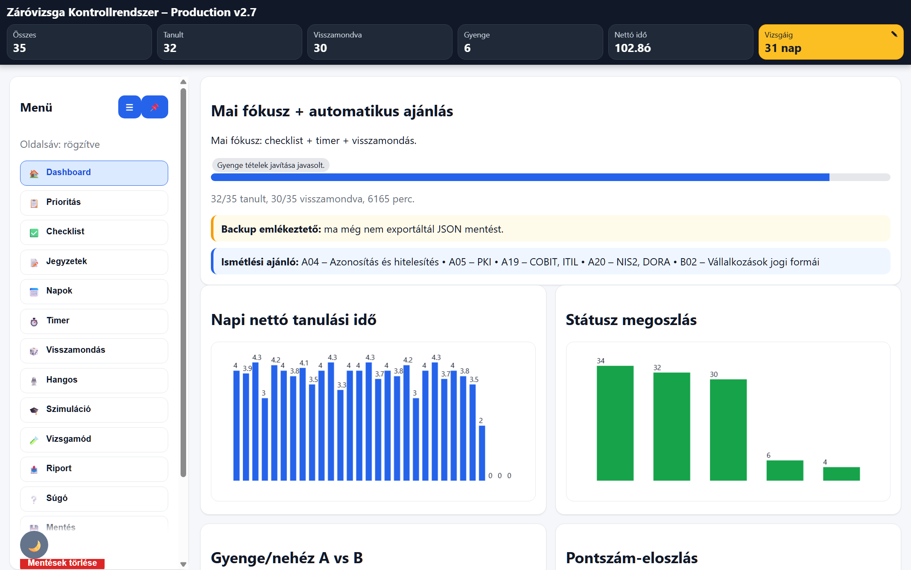
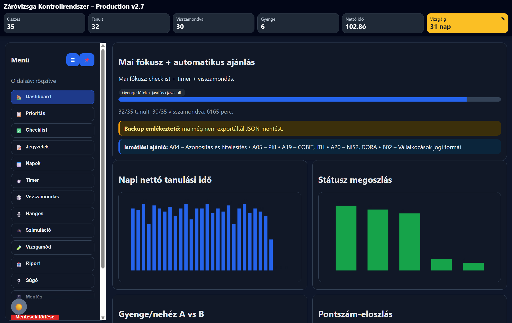
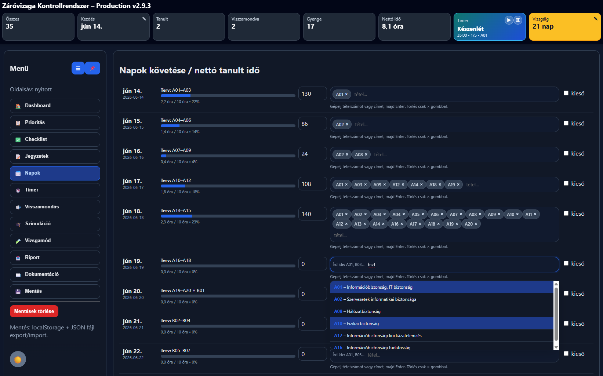
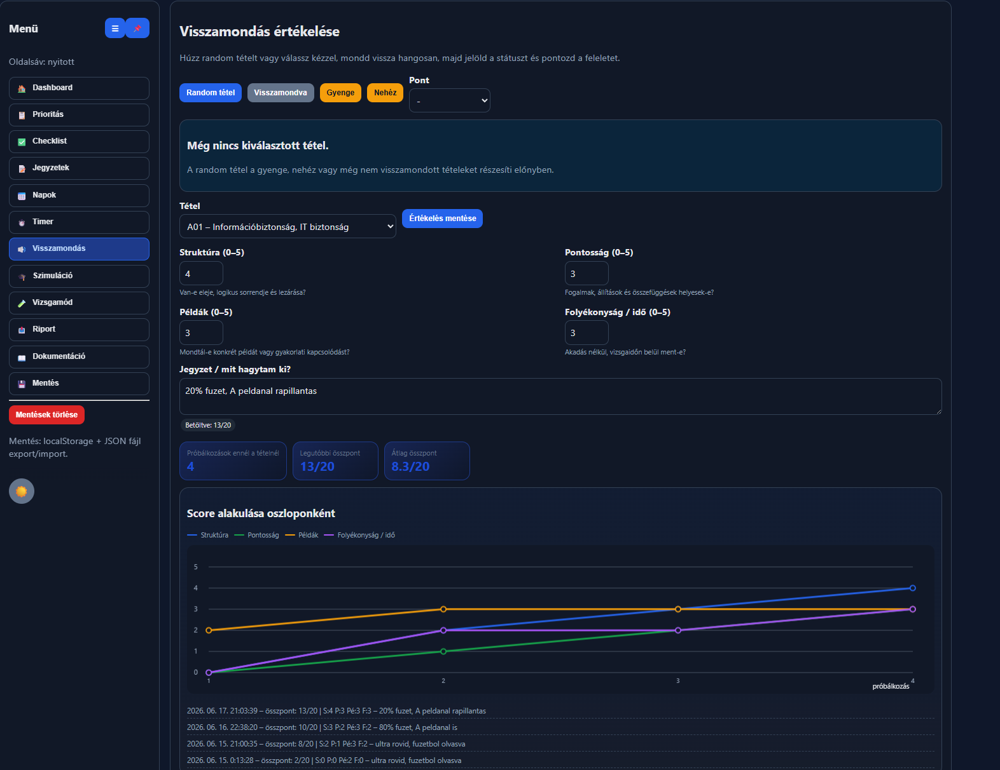
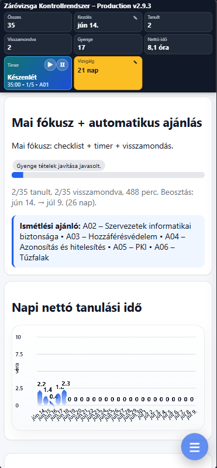
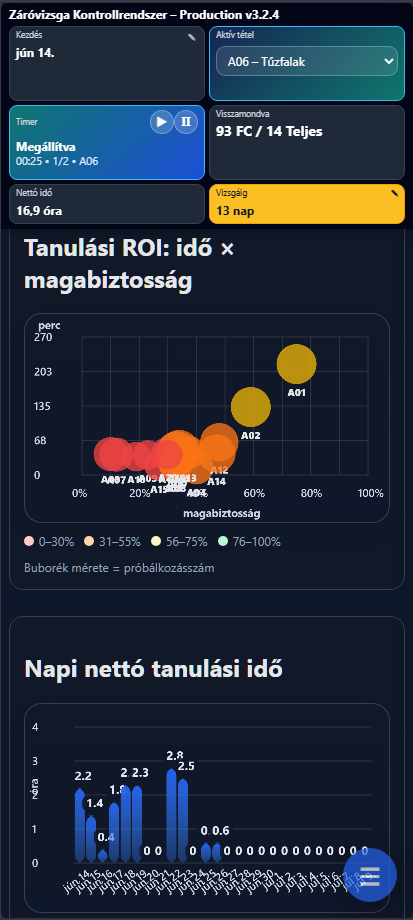

# Záróvizsga Kontrollrendszer

> **Legújabb release:** v3.2.4  
> **Letöltés:** [zarovizsga_v3.2.4_live.html](https://github.com/user-attachments/files/29361465/zarovizsga_v3.2.4_live.html)
> 

<p align="center">
  <strong>Offline, mobilbarát tanulásmenedzsment és felkészülési kontrollrendszer záróvizsgára</strong><br>
  Egyfájlos HTML alkalmazás • LocalStorage • JSON export/import • Responsive UI • Világos/sötét téma
</p>

---

## Képernyőképek

### Asztali nézet

<table>
  <tr>
    <td align="center">
      <strong>Világos téma</strong><br>
      
    </td>
    <td align="center">
      <strong>Sötét téma</strong><br>
      
    </td>
  </tr>
  <tr>
    <td align="center">
      <strong>Napok</strong><br>
      
    </td>
    <td align="center">
      <strong>Visszamondás</strong><br>
      
    </td>
  </tr>
</table>

### Mobil nézet

<table>
  <tr>
    <td align="center">
      <strong>Világos téma</strong><br>
      
    </td>
    <td align="center">
      <strong>Sötét téma</strong><br>
      
    </td>
  </tr>
</table>

---

## Tartalomjegyzék

- [Első lépések](#elsőlépések)
- [Áttekintés](#áttekintés)
- [Kinek készült?](#kinek-készült)
- [Fő funkciók](#fő-funkciók)
- [Módszertan](#módszertan)
- [Felület és menüpontok](#felület-és-menüpontok)
- [Mobilhasználat](#mobilhasználat)
- [Mentés és visszatöltés](#mentés-és-visszatöltés)
- [Import előtti biztonsági mentés](#import-előtti-biztonsági-mentés)
- [Dátumvezérelt tanulási beosztás](#dátumvezérelt-tanulási-beosztás)
- [Visszamondás](#visszamondás)
- [Vizsgamód](#vizsgamód)
- [Sötét téma](#sötét-téma)
- [Telepítés / használat](#telepítés--használat)
- [Adatkezelés](#adatkezelés)
- [Projektstruktúra](#projektstruktúra)
- [Fejlesztési megjegyzések](#fejlesztési-megjegyzések)
- [Roadmap ötletek](#roadmap-ötletek)
- [Licenc](#licenc)
- [Szerző](#szerző)

---

## Első lépések

- A mentések törlésével tudod alaphelyzetbe állítani a programot
- A **Timer** lapon kezd el a tanulást
- Használd a **Visszamondás** oldalt a gyakorláshoz

- Amennyiben a `Tételek_A01-20_2026`-at használod, akár így is lehet tanulni belőle:
  1. **Első kör:** csak az „Ultra rövid memorizálós változatokat” tanuld meg
  2. **Második kör:** minden tételnél az 5–8 perces feleletvázlatot mondd vissza hangosan
  3. **Harmadik kör:** nézd át a részletes a/b/c részeket, hogy kérdés esetén tudj példát mondani

---

## Áttekintés

A **Záróvizsga Kontrollrendszer** egy offline használható, böngészőben futó HTML alapú tanulásmenedzsment alkalmazás. A célja, hogy a záróvizsga-felkészülés ne csak érzésre történjen, hanem követhető, mérhető és rendszeresen visszacsatolt folyamat legyen.

Az alkalmazás nem tananyag-helyettesítő. Inkább egy **felkészülési irányítópult**, amely segít követni:

- melyik tételből készült már vázlat,
- melyik tétel lett megtanulva,
- melyik tétel lett visszamondva,
- melyik tétel gyenge vagy nehéz,
- milyen pontszámot adsz magadnak,
- mennyi nettó tanulási idő ment el naponta,
- mennyi időt fordítottál egy konkrét tételre,
- mikor kell ismételni,
- mikor kell JSON mentést exportálni.

Az alkalmazás teljesen kliensoldali: nincs backend, nincs adatbázis, nincs login, nincs felhős szinkronizáció. Minden adat a böngésző `localStorage` tárhelyén és az exportált JSON mentésekben él.

---

## Kinek készült?

Ez az alkalmazás olyan felhasználónak készült, aki:

- záróvizsgára vagy nagy tételsoros vizsgára készül,
- szeretné látni a teljes felkészülési állapotot,
- nem csak olvasni, hanem visszamondani is akarja a tételeket,
- szeretné látni, hogy mely tételek gyengék,
- szeretne napi tanulási kontrollt,
- offline, egyfájlos, egyszerűen hordozható megoldást keres,
- nem akar külön szervert, adatbázist vagy regisztrációt használni.

---

## Fő funkciók

### Dashboard

A Dashboard az alkalmazás fő áttekintő nézete. Itt látszik:

- összes tétel száma,
- megtanult tételek száma,
- visszamondott tételek száma,
- gyenge tételek száma,
- összes nettó tanulási idő,
- tanulás kezdődátuma,
- vizsgáig hátralévő napok száma,
- napi fókusz,
- automatikus ajánlás,
- backup emlékeztető,
- ismétlési ajánló.

A Dashboard 4 grafikont tartalmaz:

1. **Napi nettó tanulási idő**
2. **Státusz megoszlás**
3. **Gyenge/nehéz A vs B**
4. **Pontszám-eloszlás**

### Prioritási kártyák

A Prioritás nézetben minden tétel külön kártyát kap. Egy tételkártyán jelölhető:

- vázlat készült-e,
- tanult-e,
- visszamondott-e,
- gyenge-e,
- nehéz-e,
- 0–3 közötti önértékelő pontszám,
- tételre fordított tanulási idő.

Szűrési lehetőségek:

- A/B tételsor,
- kockázati szint,
- gyenge tételek,
- nehéz tételek,
- nem visszamondott tételek,
- 0–1 pontos tételek.

### Timer tételhez kötött időméréssel

A Timer nézetben először ki kell választani az aktív tételt. Ezután a fókuszidő:

- hozzáadódik az aktuális nap nettó tanulási idejéhez,
- hozzáadódik a kiválasztott tétel saját időráfordításához.

Ez azért fontos, mert így nem csak az látszik, hogy egy napon mennyit tanultál, hanem az is, hogy konkrétan melyik tételre mennyi idő ment el.

### Napi checklist

A Checklist nézet napi tanulási rutin támogatására készült. Alap checklist generálható, valamint saját terv is rögzíthető.

Tipikus checklist elemek:

- előző napi anyag visszahívása,
- fókuszblokkok,
- legalább egy jegyzet nélküli visszamondás,
- gyenge tétel javítása,
- nap végi JSON export.

### Tételenkénti jegyzetek

A Jegyzetek nézetben tételenként rögzíthető:

- feleletvázlat,
- hibajegyzet,
- kulcsfogalom,
- vizsgáztatói kérdés,
- külső tananyag link vagy keresőkifejezés.

A cél nem egy teljes jegyzetfüzet kiváltása, hanem egy 5–8 perces, vizsgán elmondható feleletvázlat karbantartása.

---

## Módszertan

Az alkalmazás három felkészülési logikát támogat.

### Opció A – kiegyensúlyozott terv

Ez az alapértelmezett stratégia.

Lépései:

1. minden tétel első feldolgozása,
2. rövid feleletvázlat készítése,
3. aktív ismétlés,
4. jegyzet nélküli visszamondás,
5. gyenge pontok javítása,
6. vizsgaszimuláció.

### Opció B – gyors lefedés

Ez akkor hasznos, ha gyorsan át kell látni a teljes tételsort.

Jellemzői:

- rövid idő alatt sok tétel első körös feldolgozása,
- utána intenzív ismétlés,
- hamar kiderülnek a gyenge pontok.

### Opció C – fallback / minimum túlélő terv

Ez krízishelyzetre készült.

Akkor érdemes aktiválni, ha:

- sok nap kiesett,
- közel a vizsga,
- sok tétel 0–1 pontos,
- nincs idő mély kidolgozásra.

Cél:

- minden tételből legyen legalább 5–7 perces minimum vázlat,
- a leggyengébb tételek kapjanak prioritást,
- új anyag helyett vizsgán elmondható minimum készüljön.

---

## Felület és menüpontok

### Dashboard

Fő áttekintő oldal, grafikonokkal és ajánlókkal.

### Prioritás

A tételállapotok fő kezelőfelülete.

### Checklist

Napi tanulási terv és ellenőrzőlista.

### Jegyzetek

Tételenkénti feleletvázlat és hibajegyzet.

### Napok

Napi nettó tanulási idő követése. A kezdődátum és a vizsgadátum módosításával a beosztás automatikusan újraszámolódik.

### Timer

Fókuszidő mérés aktív tételhez kapcsolva.

### Visszamondás

Random tételhúzás, hangos visszamondás, státuszjelölés és 0–3 közötti önértékelés egy oldalon.

### Szimuláció

Egyszerű A+B tételhúzás és gyakorlás.

### Vizsgamód

Zavartalan vizsgaszerű gyakorlás állítható időkkel.

### Riport

Nap végi státusz szöveg generálása.

### Mentés

JSON export és import.

### Dokumentáció

A Dokumentáció menüpont új böngészőfülön megnyitja a projekt GitHub oldalát.

---

## Mobilhasználat

Az alkalmazás mobilra optimalizált:

- kompakt felső sáv,
- kisebb statisztikai kártyák,
- jobb alsó lebegő hamburger gomb,
- jobbról beúszó menü,
- egyoszlopos kártyanézet,
- teljes szélességű inputok,
- mobilbarát timer,
- mobilbarát JSON import/export.

A hamburger menüben a téma kapcsoló a menü **bal alsó sarkában** található.

---

## Mentés és visszatöltés

Az alkalmazás automatikusan ment a böngésző `localStorage` tárhelyére.

Emellett ajánlott minden tanulónap végén JSON fájlt exportálni:

```text
Mentés → Export JSON fájl
```

Visszatöltés:

```text
Mentés → Import JSON fájlból
```

A JSON import/export célja, hogy:

- böngészőváltás esetén ne vesszen el az állapot,
- gépváltás esetén visszatölthető legyen a haladás,
- hibás böngésző cache törlés esetén legyen mentés.

---

## Import előtti biztonsági mentés

Import előtt az alkalmazás automatikusan letölt egy aktuális állapotmentést.

Ennek célja, hogy egy hibás vagy rossz JSON import ne írja felül véglegesen a korábbi állapotot.

---

## Dátumvezérelt tanulási beosztás

A v2.8.3 verzióban a tanulási terv már nem fix dátumtól indul. Beállítható:

- a tanulás kezdődátuma,
- a vizsga dátuma.

A két dátum módosítása után a **Napok** oldal automatikusan újraszámolja az ütemezést. Sikeres újraszámoláskor rövid, modern üzenetbuborék jelenik meg.

---

## Visszamondás

A v2.8.3 verzióban a korábbi külön Random visszamondás és Hangos visszamondás funkciók egy oldalra kerültek.

A Visszamondás oldalon elérhető:

- random tételhúzás,
- visszamondva / gyenge / nehéz státusz,
- 0–3 pontszám,
- hangos felelet értékelése,
- struktúra, pontosság, példák, folyékonyság/idő pontozása,
- jegyzet, hogy mi hiányzott.

---

## Vizsgamód

A Vizsgamód célja a zavartalan vizsgagyakorlás. Ebben a módban:

- húzható 1 A és 1 B tétel,
- állítható a felkészülési idő,
- állítható a felelési idő,
- külön timer indítható a felkészüléshez és a feleléshez.

A Vizsgamód nem adminisztrációs felület, hanem gyakorló nézet.

---

## Sötét téma

Az alkalmazás világos és sötét témát is támogat.

A téma kapcsoló:

- a hamburger menü alján,
- bal oldalon,
- hold / nap ikonnal jelenik meg.

A sötét téma külön figyel a kontrasztra:

- kártyák,
- inputok,
- szövegek,
- grafikon hátterek,
- figyelmeztetések,
- menüelemek.

---

## Telepítés / használat

Nincs telepítés.

1. Töltsd le a HTML fájlt.
2. Nyisd meg böngészőben.
3. Használd offline.
4. Nap végén exportálj JSON mentést.

Ajánlott fájl:

```text
zarovizsga_v2.8.3_live.html
```

---

## Adatkezelés

Az alkalmazás nem küld adatot szerverre.

Tárolás:

- böngésző `localStorage`,
- manuálisan exportált JSON fájlok.

Fontos:

- a `localStorage` böngészőhöz kötött,
- privát böngészésben törlődhet,
- cache törlésekor elveszhet,
- ezért kell rendszeresen JSON export.

---

## Projektstruktúra

```text
.
├── zarovizsga_v2.8.3_live.html
├── README.md
├── main.png
├── main_dark.png
├── main_mob.png
└── main_mob_dark.png
```

---

## Fejlesztési megjegyzések

Az alkalmazás szándékosan egyfájlos.

Előnyök:

- egyszerű megosztani,
- offline működik,
- nincs build folyamat,
- nincs backend,
- nincs külső függőség.

Hátrányok:

- nagyobb HTML fájl,
- nincs automatikus felhős szinkron,
- többfelhasználós mód nincs.

A többfelhasználós mód jelenleg nem cél, mert az már backend, authentikáció és adatbázis irányába vinné el a projektet.

---

## Roadmap ötletek

Lehetséges későbbi fejlesztések:

- PWA telepíthetőség,
- jobb spaced repetition algoritmus,
- exportált riportok összehasonlítása,
- részletesebb vizsgamód pontozás,
- heti összefoglaló,
- automatikus haladási mérföldkövek.

---

## Licenc

MIT License

---

## Szerző

**Készítette:** Drobina, Zsolt (GL0LFK)  
**License:** MIT license
